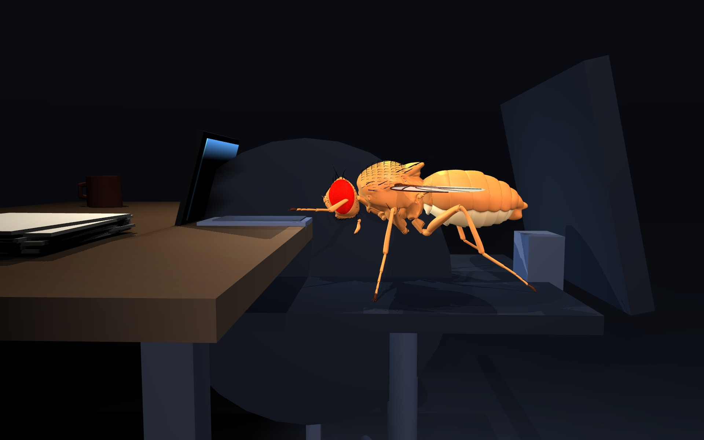

# fruitfly-9tofly

**9 to Fly** — a fruit fly works in sales. The phone rings, its Giant Fiber
fires, and it leaves the chair.



The fly is the real anatomical [flybody](https://github.com/google-deepmind/mujoco_menagerie/tree/main/flybody)
model from Google DeepMind and HHMI Janelia, rendered in MuJoCo. The brain is
809 real neurons from [MaleCNS v1.0](https://male-cns.janelia.org/), wired the
way they are in an actual fly. The startle happens when excitation genuinely
outruns inhibition in that circuit.

## Why the Giant Fiber

`DNp01` — the Giant Fiber — is the descending command neuron that triggers the
escape jump. One of the best-characterised neurons in neuroscience, and the
reason you miss when you swat.

The circuit is not hand-picked. It is seeded with DNp01 and then every neuron
with at least 5 synapses onto it is recruited, which gives 809 neurons and
21,086 connections. The two strongest inputs turn out to be **LC4** and
**LPLC2**, the looming detectors — 30% of all synaptic input to the Giant
Fiber, from two cell types out of hundreds. The literature predicts that; the
data agrees without being asked.

## What is measured and what is assumed

This is the part most projects in this genre skip.

| | Source |
|---|---|
| Which neurons connect to which | **Measured.** MaleCNS v1.0 |
| Synapse counts per connection | **Measured.** |
| Excitatory vs inhibitory | **Measured for 377/809 neurons** from experimental ground-truth neurotransmitters; predicted for the rest |
| Connection *strength* | **Assumed.** Synapse count is a proxy; the connectome does not measure physiological strength |
| Time constants, delays, plasticity, neuromodulation | **Not modelled.** Not in the dataset |
| Gap junctions | **Not modelled.** The connectome maps chemical synapses only |
| Membrane time constants, threshold voltage, synaptic gain | **Assumed.** Not in the dataset |
| The fly's movement | **Assumed.** Keyframed animation, not physics |
| *Whether* the Giant Fiber fires | **Emergent.** A spike when current outruns the leak — not a cutoff we picked |

Two caveats worth stating plainly:

**The Giant Fiber signals largely through electrical gap junctions.** A
chemical-synapse connectome under-represents its real influence. It is also
the one neuron here with no ground-truth transmitter (prediction confidence
≈0.5) — because chemical transmission isn't its main mode.

**Glutamate is treated as inhibitory** via GluClα. Usually right in
*Drosophila*, but context-dependent. It is the weakest link in the sign
assignment.

`data/circuit/manifest.json` records every one of these choices in machine-
readable form, and the demo shows a live badge separating the two columns.

## What we tested and what failed

The circuit **cannot** tell a looming object from a receding one.

`experiments/02_looming_with_receptive_fields.py` drives the looming
population with an expanding edge, then with the same edge reversed, then with
a static one. Peak Giant Fiber response:

```
loom     0.2596
recede   0.2598      loom vs recede: 1.00x
flat     0.2601      loom vs flat:   1.00x
```

No selectivity at all. A ramp test shows the response is compressive, not
thresholded — it rises at the smallest input and saturates smoothly, where a
decision would stay flat and then snap.

Both are real findings, not bugs:

1. **Looming detection is upstream of this slice.** LC4 and LPLC2 are the
   *output* of the computation. It happens in the optic lobe — the 89,403
   `ol_intrinsic` neurons excluded here. A linear sum discards temporal order,
   which is exactly what `loom vs recede = 1.00x` measures.
2. **A rate model cannot make a decision.** The real threshold is spiking
   biophysics this model does not have.

Had we only run the looming condition, Giant Fiber activity would have climbed
from 0 to 0.99 right as the object approached and it would have looked like a
success. The control is the only reason we know it was meaningless.

So the honest claim is narrower than "the fly sees and jumps":

> The connectome does the **integration and gating** — weighing excitation
> against inhibition to decide whether to fire. It does **not** do the
> perception.

Which is why the fly's job here is monitoring. A threshold detector is used as
a threshold detector.

## Why a ringing phone

Johnston's Organ is the fly's ear. Twenty of its neurons sit inside this
circuit and put **709 synapses directly onto the Giant Fiber**, so a fly
startling at a sudden noise and a fly startling at a shadow are the same
circuit doing the same thing. That is why cold calling works as a framing and
not just as a joke.

But measured honestly, the ear is **1.7% of the Giant Fiber's total input**
against 31.4% from the looming population. Even firing at the refractory limit
of 333 Hz it delivers 0.29 of current against a threshold of 1.0:

```
looming    302 neurons -> 31.4% of GF input   1.57 at 100 Hz
auditory    20 neurons ->  1.7% of GF input   0.09 at 100 Hz, 0.29 at 333 Hz
```

**The ear alone cannot fire the Giant Fiber in this model at any volume.**

A desk phone is also a visible event — a blinking light, a handset that moves,
a surface that buzzes — so the ring drives the visual channel as well, and that
is what actually crosses threshold. Stated plainly because it would be easy to
imply the sound is doing the work when it is not. The limitation is uniform
synaptic gain here, not a claim about real flies: a real fly does escape from
sound.

## The brain panel

The neurons in the corner panel are real traced morphologies, not a diagram.
`extract_skeletons.py` pulls 74 reconstructed skeletons from
`gs://flyem-male-cns/v1.0/segmentation/skeletons-malecns/` — the Giant Fibers,
a sample of LC4 and LPLC2, the Johnston's Organ neurons, and the strongest
GABAergic and glutamatergic inputs — decimates each to ~260 segments, and
projects them to a frontal view. Every branch you see was reconstructed from
electron microscopy. Blue is visual, violet is auditory, red is inhibitory,
amber is the Giant Fiber.

Each drawn skeleton is bound to a live neuron of the same role, so the
morphology brightens with that cell's activity as the simulation runs.

## The decision is a spike, not a cutoff

The first version used a rate model and asked whether Giant Fiber "activity"
exceeded a number we chose. That number was doing the deciding, which is
precisely the move that makes these projects unfalsifiable.

It is now leaky integrate-and-fire (`lif.py`). Each neuron holds a membrane
voltage that leaks toward rest. Presynaptic spikes deliver signed current.
Nothing happens until arriving current outruns the leak — and then the cell
spikes and resets. `experiments/03_lif_threshold.py` measures the difference:

```
 LIF drive   GF (Hz)   | rate drive    GF out
      0.98       0.0   |      0.020    0.0428
      1.00       0.0   |      0.040    0.0761
      1.02      50.5   |      0.070    0.1154
      1.05      51.5   |      0.110    0.1548
```

A 2% change in input takes the LIF from silence to 50 Hz. Going from 10% to
90% of maximum output needs **2.4x** more input under LIF and **26.7x** under
the rate model — measured on a scale-free metric, so the two are comparable
despite different input units. The decision is about **11x sharper**.

In the demo the fly leaves its chair when the Giant Fiber *actually spikes*.
Across 30 simulated seconds of idle on-call time it spikes zero times, so
there are no false startles; an incident produces a burst at ~59 Hz.

The time constants, threshold voltage and synaptic gain are still assumptions
— the connectome does not contain them, and they stay in the grey column. What
changed is that the *shape* of the decision now comes from the dynamics rather
than from a constant we picked.

One honest caveat: a settle counter suppresses re-triggering for ~45 frames
after a startle. Recurrent activity keeps the circuit firing after the drive
stops, which is plausible for a real fly but reads as a stutter on screen. It
gates the animation only, never the spike.

## Does the wiring actually matter?

This is the experiment the viral projects do not run, and it is the only thing
that separates "we used the real connectome" from "the real connectome did the
work". A flexible enough readout makes almost any recurrent network look
purposeful — someone drove a fly body with a *worm* connectome and it worked
fine.

So: break the wiring in specific ways, keep everything else identical, and
measure. `experiments/04_ablations.py`, 150 ms trials, detection threshold =
lowest drive at which the Giant Fiber fires in ≥50% of trials.

| network | threshold | false alarms | GF spikes @1.43 |
|---|---|---|---|
| **real connectome** | 0.96 | 0% | 14.0 |
| weights shuffled | 0.96 | 0% | 26.0 |
| **signs shuffled** | **1.52** | 0% | **0.0** |
| inputs rewired | 0.96 | 0% | 23.6 |
| fully random | 0.96 | 0% | 16.5 |

Two findings, and the first is not flattering.

**The topology is not doing the work.** Randomise which neuron connects to
which — keeping in-degree and incoming strengths — and the circuit performs
*identically*. Randomise everything and it still performs identically.
Detecting a broad increase in drive does not require specific connectivity;
any network that sums inputs and thresholds will do it. On this task, the
809-neuron MaleCNS subgraph is not beating a random graph.

**The signs are load-bearing.** Permute which neurons are inhibitory — keeping
Dale's law, the same graph, the same magnitudes — and the circuit stops
working. Threshold rises from 0.96 to 1.52 and the Giant Fiber produces zero
spikes at the drive that fires the real circuit. The excitation/inhibition
balance is what makes it function.

That is worth sitting with. The part this project took from measured data
(neurotransmitter-derived signs, 377/809 experimentally confirmed) is the part
that matters. The part everyone advertises — the connectome graph itself — is
not carrying this task.

The honest caveat on the caveat: the drive here arrives at 302 looming neurons
at once, which is broad and unstructured. That is the same limitation as the
looming result above — without the optic lobe there is no spatiotemporal
structure for the topology to exploit. Whether the wiring would matter on a
task with real structure is untested, and this repository should not claim
either way.

## Pipeline

```
MaleCNS v1.0 (Feather, ~550 MB)
  -> extract_circuit.py   seed DNp01, recruit inputs, sign edges from
                          neurotransmitters, threshold at 5 synapses
  -> export_web.py        pack to 412 KB with real soma coordinates
  -> extract_skeletons.py 74 traced morphologies -> 492 KB of line segments
  -> web/                 browser runs the circuit live; no API key, no account
```

Per frame the browser walks 21,086 edges rather than an 809×809 matrix.

```
flybody (MuJoCo, Apache-2.0)
  -> scenes/desk.xml      desk, chair, laptop proportioned to the fly
  -> render_frames.py     working pose + 14-frame startle
```

## Run it

```bash
git clone <this repo> && cd fruitfly-9tofly
make venv     # dependencies
make data     # MaleCNS downloads, ~550 MB, public, no account needed
make model    # flybody model, ~140 MB
make circuit  # -> web/circuit.json
make skels    # -> web/skeletons.json
make frames   # -> web/frames/
make web      # http://localhost:8777
```

`web/` is committed, so `make web` alone is enough to see the demo. The rest
is only needed to rebuild from source.

## Status

Working: circuit extraction with data-derived signs, leaky integrate-and-fire
simulation in the browser at 1 kHz, traced neuron morphology, MuJoCo renders,
and a startle driven by real Giant Fiber spikes.

Next: control ablations — shuffled connectome, random network with matched
statistics, and a *C. elegans* connectome driving the same body — so the
question "is the wiring doing anything?" has a number rather than an opinion.
That is the one experiment none of the viral projects run, and until it does,
this README should not claim the wiring matters.

## Credit

MaleCNS v1.0 is CC-BY: FlyEM (HHMI Janelia), the Cambridge Connectomics Group,
and Google Research. flybody and MuJoCo are Apache-2.0, Google DeepMind and
HHMI Janelia. Full detail in [ATTRIBUTION.md](ATTRIBUTION.md).

Code is MIT.
